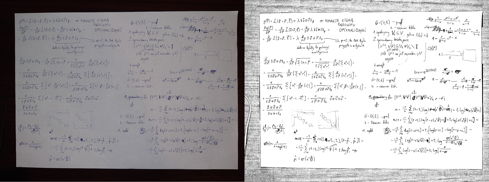
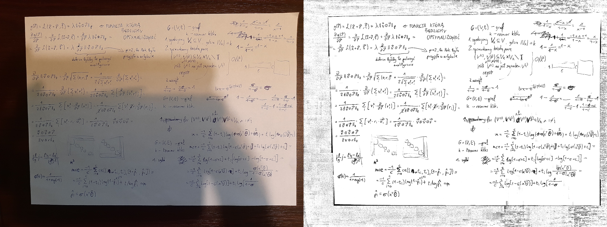
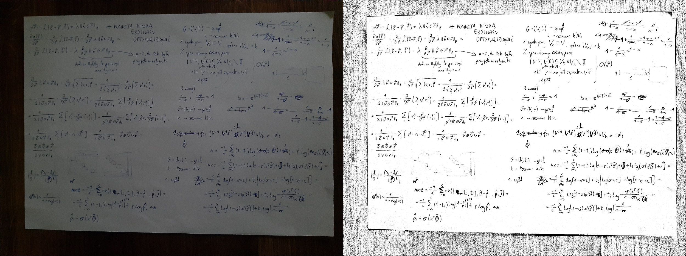

# Image Rectifier

Simple python script for enhancing photos of handwritten notes to scan-like quality in gray-scale.

### **Disclaimer**
This is not meant to be a professional tool. It is just a product of temporary need of its author (me). If you feel like you may need this, feel free to utilize it - you can also leave a star, it would be nice of you.

Keep in mind that this IS NOT a super user-friendly script. It was not even meant to be so - all it had to is to work fine: nothing less, nothing more. I assume that users know what they are doing - well, there is not even exception handling customized. This is not a big problem though, since it has only one thing to do (and if you do it properly, nothing wrong should happen).

___

## Requirements
Mind that this is rather importand part of readme ;)

In order to run this script, one need to have (obviously) Python 3 environment already installed and configured, as well as the following libraries: `numpy`, `Pillow`. Those are, however, rather popular ones, and chances are that you already have them in your base environment.

___

## How does it work?
Image is being recursively divided into a plethora of small boxes, representing similar local lighting conditions. Each of those boxes is then transformed appropriately - one can easily write their own trasformer.

The default transformer does (more or less) the following:
* finds the median gray-scale value in the box,
* stretches colors so that the previously found median is the new white, effectively clipping every pixel lighter than that,
* suppresses colors into dark part of the spectrum (black-ish/gray pixels become much darker).

___

## How to run it?
1. Run the terminal of your choice (e.g. `cmd`).
2. Navigate to the folder with photos to be enhanced.
3. Make sure that `img_rectifier.py` script file is also in that folder.
4. Type `python img_rectifier.py <filename>` or `img_rectifier.py <filename>`.
> Examples:<br>
> * `python img_rectifier.py really_bad_lighting.jpg`
> * `img_rectifier.py really_bad_lighting.jpg`

There is also a way to make it less tedious, but this would require aliasing it in some way or placing it in `/Python/Scripts` folder, if you want.

NOTE: By deafult the enhanced photos are saved with prefix '_' - therefore you should only pass filenames and not filepaths.

___

## Options
You can obviously customize runtime options, but in order to do so, you have to edit the designated setup part of the script yourself.
```python
        # === SETUP ===========================================================
        # Feel free to hardcode the desirable options
        transformer = transformers['median_contrast']
        split_factor = 1000
        maxdepth = 150
        inplace = False # If true, enhanced photo overwrites the existing one
        prefix = "_"
        # =====================================================================
```
Legend:
* `transformer` - transformer applied to the boxes at the end of recursive divisions;
* `split_factor` - let `total_pict_size` be the size of original image in pixels (i.e. `width * height`); then `total_pict_size/split_factor` is the minimum box size to be further divided;
* `maxdepth` - maximum recursion depth;
* `inplace` - if set to True, then enhanced photo will overwrite the existing one;
* `prefix` - prefix for the resulting files to save with.

It suffices that you set `maxdepth` to some rather high values (150 is fine) and only modify the `split_factor` - it being set to 1000 results in quite a fine-grained divisions; you may want to check out other values (e.g. 500, 250, 125, or even less if the picture is small) and decide for yourself which results in the best quality of the enhanced images.

___

## Which file extensions are supported?
Frankly speaking, I don't know. Surely it works fine with `.jpg` and `.png` files, but did not tested if it works with other extensions.

___

## If so, why is it even here?
Maybe someone needs such a script, the way that I did. Then help yourself ;) However, to unleash the prowess of this script it may be required to have some prior programming skills, to customize it a bit, as it is just the very foundation.

___

## Exemplary comparisons

You know, "trash in - trash out". Nonetheless, this script is pretty robust, doing surprisingly well even with photos made with pretty awful lighting conditions. Photos in the comparison below were oryginally 4000x3000px each (in order to see them in such a resolution, head to `img/fullsize` folder). 

#### Okay-ish lighing


#### Bad lighting


#### Really bad lighting


Assuming that your photos are not absolute garbage in the first place, most likely you should obtain kinda satisfactory results.